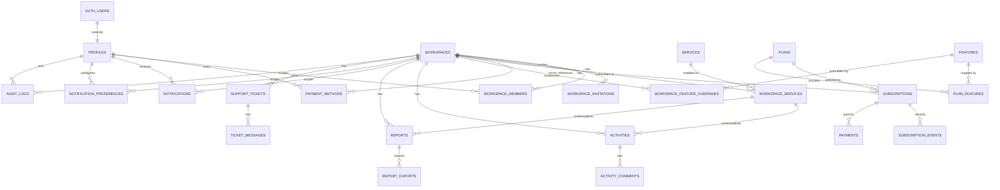

# Database ERD

This document describes the proposed Phase 3A database model. It is design
documentation only; no migrations have been applied.

## Entity relationship overview



## Common column conventions

Most tables should use:

```text
id uuid primary key default gen_random_uuid()
created_at timestamptz not null default now()
updated_at timestamptz not null default now()
```

Operational records should include:

```text
workspace_id uuid not null references public.workspaces(id)
```

Where supported by lifecycle needs, include:

```text
status text not null
source text
visibility text
metadata jsonb not null default '{}'::jsonb
```

## Authentication

### `profiles`

Extends `auth.users`.

| Column | Type | Key | Notes |
| --- | --- | --- | --- |
| `id` | `uuid` | PK, FK `auth.users(id)` | Same value as Supabase Auth user id. |
| `full_name` | `text` |  | Display name. |
| `email` | `text` |  | Copied from auth for convenience; Auth remains authoritative. |
| `avatar_url` | `text` |  | Optional profile image. |
| `platform_role` | `text` |  | `super_admin`, `team_member`, or `client`. |
| `locale` | `text` |  | User display locale. |
| `timezone` | `text` |  | User timezone. |
| `default_workspace_id` | `uuid` | FK `workspaces(id)` | Optional default workspace. |
| `created_at` | `timestamptz` |  | Creation timestamp. |
| `updated_at` | `timestamptz` |  | Update timestamp. |

Indexes:

- `profiles(email)`
- `profiles(platform_role)`
- `profiles(default_workspace_id)`

## Workspaces

### `workspaces`

Tenant container for client and internal organizations.

| Column | Type | Key | Notes |
| --- | --- | --- | --- |
| `id` | `uuid` | PK | Workspace id. |
| `name` | `text` |  | Display name. |
| `slug` | `text` | Unique | URL-safe unique identifier. |
| `type` | `text` |  | `client`, `internal`, or `partner`. |
| `status` | `text` |  | `active`, `inactive`, `suspended`, or `archived`. |
| `primary_currency` | `text` |  | ISO 4217 currency code. |
| `country_code` | `text` |  | ISO 3166 country code where applicable. |
| `timezone` | `text` |  | Workspace default timezone. |
| `locale` | `text` |  | Workspace default locale. |
| `created_by` | `uuid` | FK `profiles(id)` | Creator profile. |
| `created_at` | `timestamptz` |  | Creation timestamp. |
| `updated_at` | `timestamptz` |  | Update timestamp. |

Indexes:

- `workspaces(slug)`
- `workspaces(status)`
- `workspaces(type)`
- `workspaces(country_code)`

### `workspace_members`

Membership and workspace-level roles.

| Column | Type | Key | Notes |
| --- | --- | --- | --- |
| `id` | `uuid` | PK | Membership id. |
| `workspace_id` | `uuid` | FK `workspaces(id)` | Tenant scope. |
| `profile_id` | `uuid` | FK `profiles(id)` | Member profile. |
| `role` | `text` |  | Workspace role. |
| `status` | `text` |  | `active`, `invited`, `suspended`, or `removed`. |
| `invited_by` | `uuid` | FK `profiles(id)` | Inviting profile. |
| `joined_at` | `timestamptz` |  | Accepted membership timestamp. |
| `created_at` | `timestamptz` |  | Creation timestamp. |
| `updated_at` | `timestamptz` |  | Update timestamp. |

Constraints:

- `unique(workspace_id, profile_id)`

Indexes:

- `workspace_members(workspace_id)`
- `workspace_members(profile_id)`
- `workspace_members(role)`
- `workspace_members(status)`

### `workspace_invitations`

Pending and completed workspace invitations.

| Column | Type | Key | Notes |
| --- | --- | --- | --- |
| `id` | `uuid` | PK | Invitation id. |
| `workspace_id` | `uuid` | FK `workspaces(id)` | Tenant scope. |
| `email` | `text` |  | Invitee email. |
| `role` | `text` |  | Proposed workspace role. |
| `token_hash` | `text` |  | Hashed invitation token. |
| `status` | `text` |  | `pending`, `accepted`, `expired`, or `revoked`. |
| `invited_by` | `uuid` | FK `profiles(id)` | Inviting profile. |
| `accepted_by` | `uuid` | FK `profiles(id)` | Accepting profile. |
| `expires_at` | `timestamptz` |  | Expiration timestamp. |
| `accepted_at` | `timestamptz` |  | Acceptance timestamp. |
| `created_at` | `timestamptz` |  | Creation timestamp. |

Indexes:

- `workspace_invitations(workspace_id)`
- `workspace_invitations(email)`
- `workspace_invitations(status)`
- `workspace_invitations(token_hash)`

## Services

### `services`

Global service catalog.

| Column | Type | Key | Notes |
| --- | --- | --- | --- |
| `id` | `uuid` | PK | Service id. |
| `key` | `text` | Unique | Stable service key. |
| `name` | `text` |  | Display name. |
| `description` | `text` |  | Service description. |
| `category` | `text` |  | Product module grouping. |
| `status` | `text` |  | `active`, `inactive`, or `archived`. |
| `created_at` | `timestamptz` |  | Creation timestamp. |
| `updated_at` | `timestamptz` |  | Update timestamp. |

Indexes:

- `services(key)`
- `services(category)`
- `services(status)`

### `workspace_services`

Services enabled for a workspace.

| Column | Type | Key | Notes |
| --- | --- | --- | --- |
| `id` | `uuid` | PK | Workspace service id. |
| `workspace_id` | `uuid` | FK `workspaces(id)` | Tenant scope. |
| `service_id` | `uuid` | FK `services(id)` | Global service. |
| `status` | `text` |  | `active`, `paused`, `ended`, or `archived`. |
| `delivery_owner_id` | `uuid` | FK `profiles(id)` | Internal owner. |
| `start_date` | `date` |  | Service start date. |
| `end_date` | `date` |  | Service end date. |
| `notes` | `text` |  | Internal setup notes. |
| `created_at` | `timestamptz` |  | Creation timestamp. |
| `updated_at` | `timestamptz` |  | Update timestamp. |

Constraints:

- `unique(workspace_id, service_id)`

Indexes:

- `workspace_services(workspace_id)`
- `workspace_services(service_id)`
- `workspace_services(status)`
- `workspace_services(delivery_owner_id)`

## Subscriptions

### `plans`

Global subscription plan catalog.

| Column | Type | Key | Notes |
| --- | --- | --- | --- |
| `id` | `uuid` | PK | Plan id. |
| `key` | `text` | Unique | Stable plan key. |
| `name` | `text` |  | Display name. |
| `description` | `text` |  | Plan description. |
| `status` | `text` |  | `active`, `inactive`, or `archived`. |
| `billing_interval` | `text` |  | `monthly`, `quarterly`, `yearly`, or `custom`. |
| `currency` | `text` |  | ISO 4217 code. |
| `amount_minor` | `integer` |  | Amount in minor units. |
| `metadata` | `jsonb` |  | Plan context. |
| `created_at` | `timestamptz` |  | Creation timestamp. |
| `updated_at` | `timestamptz` |  | Update timestamp. |

Indexes:

- `plans(key)`
- `plans(status)`
- `plans(currency)`

### `subscriptions`

Workspace subscription state.

| Column | Type | Key | Notes |
| --- | --- | --- | --- |
| `id` | `uuid` | PK | Subscription id. |
| `workspace_id` | `uuid` | FK `workspaces(id)` | Tenant scope. |
| `plan_id` | `uuid` | FK `plans(id)` | Selected plan. |
| `status` | `text` |  | Subscription state. |
| `source` | `text` |  | `automatic` or `manual`. |
| `provider` | `text` |  | `stripe`, `mpesa`, or `manual`. |
| `provider_subscription_id` | `text` |  | External provider reference. |
| `current_period_start` | `timestamptz` |  | Period start. |
| `current_period_end` | `timestamptz` |  | Period end. |
| `trial_ends_at` | `timestamptz` |  | Trial end. |
| `cancel_at` | `timestamptz` |  | Scheduled cancellation. |
| `canceled_at` | `timestamptz` |  | Actual cancellation. |
| `created_by` | `uuid` | FK `profiles(id)` | Manual creator, if applicable. |
| `created_at` | `timestamptz` |  | Creation timestamp. |
| `updated_at` | `timestamptz` |  | Update timestamp. |

Indexes:

- `subscriptions(workspace_id)`
- `subscriptions(plan_id)`
- `subscriptions(status)`
- `subscriptions(provider, provider_subscription_id)`
- `subscriptions(current_period_end)`

### `subscription_events`

Append-only subscription lifecycle events.

| Column | Type | Key | Notes |
| --- | --- | --- | --- |
| `id` | `uuid` | PK | Event id. |
| `subscription_id` | `uuid` | FK `subscriptions(id)` | Subscription scope. |
| `workspace_id` | `uuid` | FK `workspaces(id)` | Tenant scope. |
| `event_type` | `text` |  | Lifecycle event type. |
| `source` | `text` |  | `stripe`, `mpesa`, `admin`, or `system`. |
| `provider` | `text` |  | Payment provider. |
| `provider_event_id` | `text` |  | External event id. |
| `payload` | `jsonb` |  | Provider or manual event payload. |
| `created_by` | `uuid` | FK `profiles(id)` | Manual actor, if applicable. |
| `created_at` | `timestamptz` |  | Event timestamp. |

Indexes:

- `subscription_events(subscription_id)`
- `subscription_events(workspace_id)`
- `subscription_events(event_type)`
- `subscription_events(provider, provider_event_id)`
- `subscription_events(created_at)`

## Payments

### `payments`

Payment attempts and outcomes.

| Column | Type | Key | Notes |
| --- | --- | --- | --- |
| `id` | `uuid` | PK | Payment id. |
| `workspace_id` | `uuid` | FK `workspaces(id)` | Tenant scope. |
| `subscription_id` | `uuid` | FK `subscriptions(id)` | Related subscription. |
| `provider` | `text` |  | `stripe`, `mpesa`, or `manual`. |
| `provider_payment_id` | `text` |  | External payment reference. |
| `status` | `text` |  | Payment status. |
| `amount_minor` | `integer` |  | Amount in minor units. |
| `currency` | `text` |  | ISO 4217 code. |
| `paid_at` | `timestamptz` |  | Successful payment timestamp. |
| `failed_at` | `timestamptz` |  | Failure timestamp. |
| `metadata` | `jsonb` |  | Provider details. |
| `created_at` | `timestamptz` |  | Creation timestamp. |
| `updated_at` | `timestamptz` |  | Update timestamp. |

Indexes:

- `payments(workspace_id)`
- `payments(subscription_id)`
- `payments(status)`
- `payments(provider, provider_payment_id)`
- `payments(currency)`
- `payments(created_at)`

### `payment_methods`

References to provider-managed payment methods.

| Column | Type | Key | Notes |
| --- | --- | --- | --- |
| `id` | `uuid` | PK | Payment method id. |
| `workspace_id` | `uuid` | FK `workspaces(id)` | Tenant scope. |
| `profile_id` | `uuid` | FK `profiles(id)` | Owner profile. |
| `provider` | `text` |  | Payment provider. |
| `provider_payment_method_id` | `text` |  | External reference. |
| `type` | `text` |  | `card`, `mpesa`, `bank`, or `manual`. |
| `label` | `text` |  | Display label. |
| `status` | `text` |  | Method status. |
| `is_default` | `boolean` |  | Default method flag. |
| `metadata` | `jsonb` |  | Non-sensitive provider context. |
| `created_at` | `timestamptz` |  | Creation timestamp. |
| `updated_at` | `timestamptz` |  | Update timestamp. |

Indexes:

- `payment_methods(workspace_id)`
- `payment_methods(profile_id)`
- `payment_methods(provider, provider_payment_method_id)`
- `payment_methods(is_default)`

## Feature Flags

### `features`

Global feature registry.

| Column | Type | Key | Notes |
| --- | --- | --- | --- |
| `id` | `uuid` | PK | Feature id. |
| `key` | `text` | Unique | Stable feature key. |
| `name` | `text` |  | Display name. |
| `description` | `text` |  | Feature description. |
| `status` | `text` |  | `active`, `inactive`, or `archived`. |
| `created_at` | `timestamptz` |  | Creation timestamp. |
| `updated_at` | `timestamptz` |  | Update timestamp. |

Indexes:

- `features(key)`
- `features(status)`

### `plan_features`

Features included in plans.

| Column | Type | Key | Notes |
| --- | --- | --- | --- |
| `id` | `uuid` | PK | Plan feature id. |
| `plan_id` | `uuid` | FK `plans(id)` | Plan. |
| `feature_id` | `uuid` | FK `features(id)` | Feature. |
| `enabled` | `boolean` |  | Whether enabled by plan. |
| `limits` | `jsonb` |  | Plan-specific feature limits. |
| `created_at` | `timestamptz` |  | Creation timestamp. |
| `updated_at` | `timestamptz` |  | Update timestamp. |

Constraints:

- `unique(plan_id, feature_id)`

Indexes:

- `plan_features(plan_id)`
- `plan_features(feature_id)`

### `workspace_feature_overrides`

Manual feature overrides for custom arrangements.

| Column | Type | Key | Notes |
| --- | --- | --- | --- |
| `id` | `uuid` | PK | Override id. |
| `workspace_id` | `uuid` | FK `workspaces(id)` | Tenant scope. |
| `feature_id` | `uuid` | FK `features(id)` | Feature. |
| `enabled` | `boolean` |  | Override enabled state. |
| `limits` | `jsonb` |  | Workspace-specific limits. |
| `reason` | `text` |  | Reason for override. |
| `expires_at` | `timestamptz` |  | Optional expiry. |
| `created_by` | `uuid` | FK `profiles(id)` | Admin actor. |
| `created_at` | `timestamptz` |  | Creation timestamp. |
| `updated_at` | `timestamptz` |  | Update timestamp. |

Constraints:

- `unique(workspace_id, feature_id)`

Indexes:

- `workspace_feature_overrides(workspace_id)`
- `workspace_feature_overrides(feature_id)`
- `workspace_feature_overrides(expires_at)`

## Activities

### `activities`

Shared activity stream across service modules.

| Column | Type | Key | Notes |
| --- | --- | --- | --- |
| `id` | `uuid` | PK | Activity id. |
| `workspace_id` | `uuid` | FK `workspaces(id)` | Tenant scope. |
| `workspace_service_id` | `uuid` | FK `workspace_services(id)` | Optional service context. |
| `actor_id` | `uuid` | FK `profiles(id)` | Human actor, if applicable. |
| `title` | `text` |  | Activity title. |
| `body` | `text` |  | Activity body. |
| `type` | `text` |  | Activity type. |
| `visibility` | `text` |  | `internal` or `client`. |
| `source` | `text` |  | `manual`, `automation`, `integration`, or `system`. |
| `metadata` | `jsonb` |  | Context payload. |
| `occurred_at` | `timestamptz` |  | Business event timestamp. |
| `created_at` | `timestamptz` |  | Creation timestamp. |
| `updated_at` | `timestamptz` |  | Update timestamp. |

Indexes:

- `activities(workspace_id, occurred_at)`
- `activities(workspace_service_id)`
- `activities(actor_id)`
- `activities(type)`
- `activities(visibility)`
- `activities(source)`

### `activity_comments`

Comments on activities.

| Column | Type | Key | Notes |
| --- | --- | --- | --- |
| `id` | `uuid` | PK | Comment id. |
| `activity_id` | `uuid` | FK `activities(id)` | Parent activity. |
| `workspace_id` | `uuid` | FK `workspaces(id)` | Tenant scope. |
| `author_id` | `uuid` | FK `profiles(id)` | Comment author. |
| `body` | `text` |  | Comment body. |
| `visibility` | `text` |  | `internal` or `client`. |
| `created_at` | `timestamptz` |  | Creation timestamp. |
| `updated_at` | `timestamptz` |  | Update timestamp. |

Indexes:

- `activity_comments(activity_id)`
- `activity_comments(workspace_id)`
- `activity_comments(author_id)`
- `activity_comments(visibility)`

## Reports

### `reports`

Client-facing and internal reports.

| Column | Type | Key | Notes |
| --- | --- | --- | --- |
| `id` | `uuid` | PK | Report id. |
| `workspace_id` | `uuid` | FK `workspaces(id)` | Tenant scope. |
| `workspace_service_id` | `uuid` | FK `workspace_services(id)` | Optional service context. |
| `title` | `text` |  | Report title. |
| `period_start` | `date` |  | Reporting period start. |
| `period_end` | `date` |  | Reporting period end. |
| `status` | `text` |  | `draft`, `in_review`, `published`, or `archived`. |
| `visibility` | `text` |  | `internal` or `client`. |
| `source` | `text` |  | `manual`, `automation`, or `hybrid`. |
| `summary` | `text` |  | Report summary. |
| `content` | `jsonb` |  | Structured report content. |
| `prepared_by` | `uuid` | FK `profiles(id)` | Report preparer. |
| `reviewed_by` | `uuid` | FK `profiles(id)` | Reviewer. |
| `published_at` | `timestamptz` |  | Publication timestamp. |
| `created_at` | `timestamptz` |  | Creation timestamp. |
| `updated_at` | `timestamptz` |  | Update timestamp. |

Indexes:

- `reports(workspace_id, period_start, period_end)`
- `reports(workspace_service_id)`
- `reports(status)`
- `reports(published_at)`

### `report_exports`

Generated report files.

| Column | Type | Key | Notes |
| --- | --- | --- | --- |
| `id` | `uuid` | PK | Export id. |
| `report_id` | `uuid` | FK `reports(id)` | Parent report. |
| `workspace_id` | `uuid` | FK `workspaces(id)` | Tenant scope. |
| `format` | `text` |  | `pdf`, `csv`, `xlsx`, or future format. |
| `storage_path` | `text` |  | Supabase Storage path. |
| `status` | `text` |  | Export state. |
| `generated_by` | `uuid` | FK `profiles(id)` | Generator profile. |
| `generated_at` | `timestamptz` |  | Generation timestamp. |
| `created_at` | `timestamptz` |  | Creation timestamp. |

Indexes:

- `report_exports(report_id)`
- `report_exports(workspace_id)`
- `report_exports(status)`
- `report_exports(generated_at)`

## Notifications

### `notifications`

User notifications.

| Column | Type | Key | Notes |
| --- | --- | --- | --- |
| `id` | `uuid` | PK | Notification id. |
| `workspace_id` | `uuid` | FK `workspaces(id)` | Tenant scope. |
| `recipient_id` | `uuid` | FK `profiles(id)` | Recipient profile. |
| `type` | `text` |  | Notification type. |
| `title` | `text` |  | Notification title. |
| `body` | `text` |  | Notification body. |
| `status` | `text` |  | Delivery/read status. |
| `channel` | `text` |  | `in_app`, `email`, `sms`, or future channel. |
| `metadata` | `jsonb` |  | Context payload. |
| `read_at` | `timestamptz` |  | Read timestamp. |
| `created_at` | `timestamptz` |  | Creation timestamp. |

Indexes:

- `notifications(workspace_id)`
- `notifications(recipient_id, read_at)`
- `notifications(status)`
- `notifications(type)`
- `notifications(created_at)`

### `notification_preferences`

User notification preferences.

| Column | Type | Key | Notes |
| --- | --- | --- | --- |
| `id` | `uuid` | PK | Preference id. |
| `profile_id` | `uuid` | FK `profiles(id)` | User profile. |
| `workspace_id` | `uuid` | FK `workspaces(id)` | Tenant scope. |
| `channel` | `text` |  | Notification channel. |
| `type` | `text` |  | Notification type. |
| `enabled` | `boolean` |  | Preference value. |
| `created_at` | `timestamptz` |  | Creation timestamp. |
| `updated_at` | `timestamptz` |  | Update timestamp. |

Constraints:

- `unique(profile_id, workspace_id, channel, type)`

Indexes:

- `notification_preferences(profile_id)`
- `notification_preferences(workspace_id)`
- `notification_preferences(channel, type)`

## Support

### `support_tickets`

Workspace support tickets.

| Column | Type | Key | Notes |
| --- | --- | --- | --- |
| `id` | `uuid` | PK | Ticket id. |
| `workspace_id` | `uuid` | FK `workspaces(id)` | Tenant scope. |
| `requester_id` | `uuid` | FK `profiles(id)` | Requesting user. |
| `assignee_id` | `uuid` | FK `profiles(id)` | Assigned internal user. |
| `workspace_service_id` | `uuid` | FK `workspace_services(id)` | Optional service context. |
| `subject` | `text` |  | Ticket subject. |
| `status` | `text` |  | Ticket status. |
| `priority` | `text` |  | Ticket priority. |
| `category` | `text` |  | Ticket category. |
| `visibility` | `text` |  | `internal` or `client`. |
| `created_at` | `timestamptz` |  | Creation timestamp. |
| `updated_at` | `timestamptz` |  | Update timestamp. |
| `closed_at` | `timestamptz` |  | Closure timestamp. |

Indexes:

- `support_tickets(workspace_id)`
- `support_tickets(requester_id)`
- `support_tickets(assignee_id)`
- `support_tickets(status)`
- `support_tickets(priority)`
- `support_tickets(category)`
- `support_tickets(created_at)`

### `ticket_messages`

Messages in support tickets.

| Column | Type | Key | Notes |
| --- | --- | --- | --- |
| `id` | `uuid` | PK | Message id. |
| `ticket_id` | `uuid` | FK `support_tickets(id)` | Parent ticket. |
| `workspace_id` | `uuid` | FK `workspaces(id)` | Tenant scope. |
| `author_id` | `uuid` | FK `profiles(id)` | Author profile. |
| `body` | `text` |  | Message body. |
| `visibility` | `text` |  | `internal` or `client`. |
| `source` | `text` |  | `manual`, `automation`, `integration`, or `system`. |
| `created_at` | `timestamptz` |  | Creation timestamp. |
| `updated_at` | `timestamptz` |  | Update timestamp. |

Indexes:

- `ticket_messages(ticket_id)`
- `ticket_messages(workspace_id)`
- `ticket_messages(author_id)`
- `ticket_messages(visibility)`
- `ticket_messages(created_at)`

## Audit

### `audit_logs`

Append-only audit trail.

| Column | Type | Key | Notes |
| --- | --- | --- | --- |
| `id` | `uuid` | PK | Audit event id. |
| `workspace_id` | `uuid` | FK `workspaces(id)` | Tenant scope, nullable for platform events. |
| `actor_id` | `uuid` | FK `profiles(id)` | Acting user, nullable for system events. |
| `action` | `text` |  | Action name. |
| `entity_type` | `text` |  | Entity/table name. |
| `entity_id` | `uuid` |  | Entity id. |
| `source` | `text` |  | `manual`, `automation`, `integration`, or `system`. |
| `ip_address` | `inet` |  | Request IP where available. |
| `user_agent` | `text` |  | Request user agent where available. |
| `before_state` | `jsonb` |  | Previous state when safe to record. |
| `after_state` | `jsonb` |  | New state when safe to record. |
| `metadata` | `jsonb` |  | Additional context. |
| `created_at` | `timestamptz` |  | Event timestamp. |

Indexes:

- `audit_logs(workspace_id, created_at)`
- `audit_logs(actor_id)`
- `audit_logs(action)`
- `audit_logs(entity_type, entity_id)`
- `audit_logs(source)`

## Future table extensions

Future phases may add:

- Service-specific project tables.
- Social account and analytics snapshot tables.
- File ownership and storage authorization tables.
- Provider-specific Stripe and M-Pesa detail tables.
- Notification delivery attempt logs.
- Automation run logs.
- AI chatbot and prompt execution logs.
